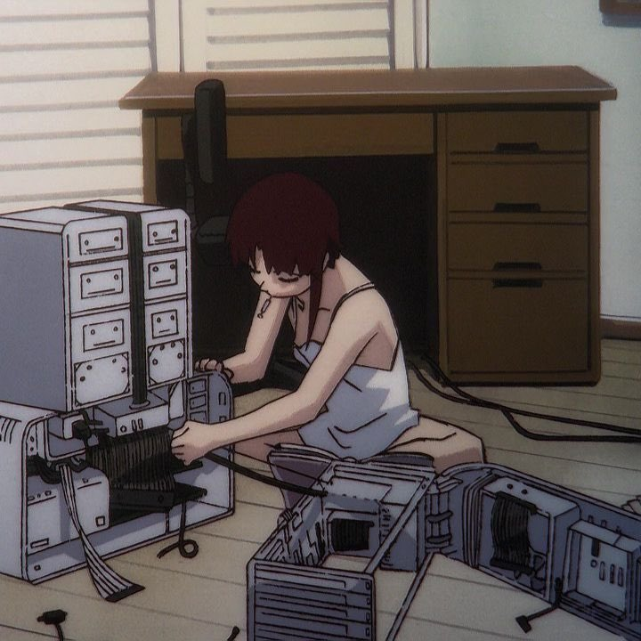

# Joao Gebara

---

### Software Engineer

    Degree in computer science, I have professional experience in full-stack web development and embedded systems in the industrial automation field.  
    Always trying to learn something new or just reinvent the wheel!

---

### 🛠 Main Skills

- C++
- C#
- C
- Java
- Linux
- Siemens WinCC and STEP7.
- Program PLCs (S7-1500/1200) in Ladder, SCL, C, C# and more.

### 💡 Interests

- Embedded & Industrial Automation
- Game Design & Development
- Web!

### 👋 Contact me
🌐 [website](https://gebarito.github.io/)  
📧 [e-mail](mailto:joao.gebara.dev@gmail.com)  
👥 [linkedin](https://www.linkedin.com/in/joaogebara/)

---

